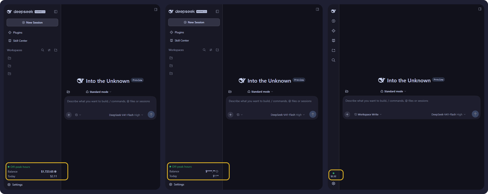

# harness-accountant

harness-accountant is a simple plugin that monitors your live DeepSeek token
balance and usage, and tells you whether the current hour is billed at the peak
or the off-peak rate.



**In one line:** a live DeepSeek balance, the spend derived from it, and the
current peak-hour state, shown inside the DSH Web GUI and nowhere else.

---

## Table of contents

- [harness-accountant](#harness-accountant)
  - [Table of contents](#table-of-contents)
  - [Overview](#overview)
  - [Language and currency](#language-and-currency)
    - [Language: English only](#language-english-only)
    - [Currency: USD and CNY, both supported](#currency-usd-and-cny-both-supported)
  - [What it does not do](#what-it-does-not-do)
  - [The two surfaces](#the-two-surfaces)
    - [The sidebar card](#the-sidebar-card)
    - [The settings panel](#the-settings-panel)
  - [How it works](#how-it-works)
    - [Money is never a float](#money-is-never-a-float)
    - [Peak is decided by the clock, in the browser](#peak-is-decided-by-the-clock-in-the-browser)
  - [Requirements](#requirements)
  - [Install](#install)
    - [Install the row](#install-the-row)
    - [Give it your API key](#give-it-your-api-key)
    - [Check that it worked](#check-that-it-worked)
    - [Roll back](#roll-back)
  - [Configuration](#configuration)
  - [Troubleshooting](#troubleshooting)
  - [Security](#security)
  - [Development](#development)
    - [Developing against a working copy](#developing-against-a-working-copy)
  - [Attribution](#attribution)
  - [Licence](#licence)

---

## Overview

The plugin does three things, and all three are live:

| | what it shows | where it comes from |
| --- | --- | --- |
| **Balance** | the account's current DeepSeek balance | `GET /user/balance`, polled once a minute by default |
| **Usage** | how much has been spent, as 1 day / 7 day / 1 month windows and a per-day list | the movement of the balance between readings, folded into a small daily ledger |
| **Peak-hour state** | whether the current hour is billed at the peak rate or the off-peak rate, named and colour-coded | DeepSeek's published UTC schedule, evaluated in the browser against the wall clock |

Peak is shown as a **yellow** indicator and off-peak as a **green** one, above the
balance. The schedule is DeepSeek's, not a guess: peak hours are 01:00 - 04:00 and
06:00 - 10:00 UTC, Monday to Friday, and every other hour - weekends included - is
off-peak.

## Language and currency

These are two separate things, and it is worth being clear about both.

### Language: English only

**This project is English only.** There is no multi-language support at all: no
translation files, no locale detection, no language setting, and no right-to-left
handling. Every user-facing string is written directly into `lib/client.js`, so
adding a second language would mean introducing a dictionary plus the setting that
chooses between them. That is a feature this plugin does not have today, and the
interface will stay in English until it does.

### Currency: USD and CNY, both supported

Currency is a different question, and here the plugin is **not** limited. Two
currencies are supported - **USD** and **CNY** - and neither is treated as the
default for the other.

The plugin never assumes a currency. On every probe it reads the wallets DeepSeek
reports for the account and accounts in the currency it actually finds:

- an account that reports **one** wallet is followed, whichever it is, CNY included;
- an account that reports **both** is taken in the order the response itself lists
  them, with no built-in preference, unless you pin one with the
  `currency` setting.

There is no exchange rate anywhere in the plugin and no conversion is ever
performed. A balance reported as `4.58` is rendered as `$4.58` or as the same
number with the yuan sign, depending only on what the response said. The two are
never added together: changing currency discards the accumulated day series rather
than mixing units that are not comparable.

Setting the language and setting the currency are therefore unrelated: one is
fixed at English, the other already handles both currencies DeepSeek reports.

## What it does not do

No coding-plan quotas, no per-provider adapters, no voucher art, no session
switching, no multi-language dictionaries, no build step. Roughly 2,500 lines
covering the host half and the browser half, and four runtime files.

## The two surfaces

The plugin adds exactly two things to the GUI, and both are optional to look at.

### The sidebar card

A card seated directly above the **Settings** row, showing the current billing
tier (peak or off-peak, named and colour-coded), the balance with an eye toggle
that masks it, and today's spend.

Collapse the sidebar and the 56px rail has no room for labelled rows, so the card
keeps the tier as a slowly breathing coloured circle above today's spend and moves
the balance into its tooltip.

### The settings panel

A detailed panel in the Settings modal: the same balance, with 1 day / 7 days /
1 month breakdowns, totals, and a per-day spend bar list. Its row in the settings
nav carries a coin stack instead of the gear the shell draws for every section it
does not know about.

## How it works

```
lib/ledger.js   pure: money as integer micro-units, daily folding, pruning
lib/probe.js    the ONLY file touching a secret or the network
lib/index.js    host: poll loop, atomic ledger on disk, two loopback routes
lib/client.js   browser: sidebar card + settings panel, no bundler, no JSX
```

The host asks DeepSeek for the balance, folds each reading into a small daily
ledger under `$DSH_HOME/harness-accountant/ledger.json`, and serves the result as
JSON. The browser half only ever receives formatted numbers - it never sees the
API key, the credential reference, or the ledger path.

Spend is the **movement of the account balance between readings**. That means it
covers every session and client on the account, not just the current window. A
balance that rises is recorded as a top-up rather than netted against spend.

### Money is never a float

`/user/balance` answers with a decimal *string*. Subtracting floats would drift,
so every amount is parsed into signed integer micro-units (1 unit = 1e-6 of the
currency) and only formatted back to a string at the edge.

### Peak is decided by the clock, in the browser

DeepSeek bills peak hours at twice the off-peak rate, and publishes the schedule
as *"01:00 - 04:00 and 06:00 - 10:00 UTC, Monday through Friday, excluding Chinese
public holidays"*; every other hour, weekends included, is off-peak.

The host does not evaluate that schedule. It **publishes** it - `peak` in the
`/overview` payload, windows given in minutes from midnight UTC - and the browser
half owns the clock, because the tier is a pure function of the wall clock and a
round trip would be strictly worse than reading a clock the browser already has.
Nothing is polled for it and no fixed ticker is spent on it: exactly one
`setTimeout` is armed, for the instant the tier next changes, and the tier is
always recomputed from `Date.now()` rather than advanced by the timer, so a
throttled, coalesced or sleep-delayed wakeup can only delay the correction, never
leave the reading stale. A `visibilitychange` refresh covers the tab that slept
through the boundary altogether.

Only the tier's coloured circle moves - never the words beside it - and it moves
slowly: one composited opacity cycle lasting three seconds, which reads as a
status light rather than an alarm. It is dropped entirely under
`prefers-reduced-motion`, where the circle simply stays lit.

Since the schedule is in UTC and the comparison is done in UTC, the indicator is
correct in **any** timezone - the reader's own clock never enters the decision.
Only the tooltip renders in local time, where it names the boundary and, when that
boundary is not today, the weekday. That is what makes a Friday readable: the next
peak is then Monday morning.

Chinese public holidays are deliberately **not** modelled, because this plugin
carries no holiday calendar. On those days it reports peak while DeepSeek bills
off-peak. The omission is not silent: `holidays_modelled: false` travels to the
client and the tooltip says "public holidays not modelled". The schedule itself is
not configurable - it is DeepSeek's published one, a frozen constant in
`lib/index.js`.

An unusable schedule - missing, in another reference frame, a malformed window, a
weekday outside the week - degrades to off-peak with no ticker at all, which is
the stated default and costs nothing. An indicator that says nothing beats one
that guesses.

## Requirements

- A DSH profile that boots the **Web GUI** (`dsh web`). This plugin ships no
  window of its own - it seats a card in the sidebar and a section in the Settings
  modal - so it needs the shell that has those.
- **Node 20 or newer**, which is what `engines.node` declares and what CI runs.
- A **DeepSeek API key**. The balance endpoint is authenticated, and the key is the
  only thing you have to supply yourself; see *Give it your API key* below.
- The `dsh` CLI, because `dsh plugin` is what installs the row.

The interface is English only; the account may be denominated in USD or CNY, and
both are handled.

## Install

Hosted at
[github.com/its0din-ai/harness-accountant](https://github.com/its0din-ai/harness-accountant).
The package is deliberately **not** published to npm: the supported channel is a
git install, which is what the commands below use.

### Install the row

```sh
# 1. back up the profile wiring first - this is also the rollback
cp ~/.dsh/profiles/web/package.json      ~/.dsh/profiles/web/package.json.bak
cp ~/.dsh/profiles/web/cordis.patch.yml  ~/.dsh/profiles/web/cordis.patch.yml.bak

# 2. add the package to the web profile
dsh plugin --profile web add \
  git+https://github.com/its0din-ai/harness-accountant.git

# 3. restart the web app: stop the running `dsh web`, then start it again
```

Then reload the GUI at http://127.0.0.1:3080.

**The restart is required for an install**, because the plugin's row is composed
into the profile at boot and a running process does not see a row added underneath
it. It is *not* required after a settings change: saving the settings page re-reads
the new values into the live fiber.

To pin a revision, append a tag or commit to the URL:

```sh
dsh plugin --profile web add \
  git+https://github.com/its0din-ai/harness-accountant.git#v1.0.1
```

### Give it your API key

The plugin never asks you for a key and never stores one. On every probe it asks
the platform's credential seam for the **name** `DEEPSEEK_API_KEY`, and the seam
resolves that name in this order:

1. the **environment** of the process running `dsh web`,
2. the **store** at `~/.dsh/.credentials.yaml`,
3. a **`.env`** file.

So either export it before you start the web app:

```sh
export DEEPSEEK_API_KEY=sk-...
dsh web
```

or write it into the store, which survives restarts:

```yaml
# ~/.dsh/.credentials.yaml - keep this file at mode 0600
version: 1
refs:
  DEEPSEEK_API_KEY: sk-...
```

**Do not put the key in `cordis.patch.yml`.** That file takes the *name*
(`api_key_env: DEEPSEEK_API_KEY`), never the value. The value stays in the
credential store so the configuration can be copied, shared, or rendered in a
settings UI without leaking it. An empty value counts as absent, so a blank
`DEEPSEEK_API_KEY` behaves exactly like no key at all rather than failing quietly
at the API.

### Check that it worked

Within about a minute of the restart - one poll interval - you should see:

- a card in the sidebar, directly above the **Settings** row, showing the tier, the
  balance and today's spend. The first reading *is* the opening balance, so today's
  spend stays `0.00` until a second reading arrives;
- an **Accountant** row in the Settings modal, with 1 day / 7 days / 1 month tabs.

`~/.dsh/harness-accountant/ledger.json` is created by the first successful probe,
at mode `0600` inside a `0700` directory. If it is not there, the probe is not
succeeding; see Troubleshooting.

### Roll back

The two `.bak` files taken in step 1 are the whole rollback:

```sh
cp ~/.dsh/profiles/web/package.json.bak      ~/.dsh/profiles/web/package.json
cp ~/.dsh/profiles/web/cordis.patch.yml.bak  ~/.dsh/profiles/web/cordis.patch.yml
# then restart the web app
```

That does not remove the ledger under `~/.dsh/harness-accountant/`, which can be
deleted on its own; it holds nothing but daily balances and today's readings.

## Configuration

The schema lives in `lib/index.js` and the defaults are written out in
`cordis.patch.yml`, so the settings page shows real, editable values.

| key | default | notes |
| --- | --- | --- |
| `enabled` | `true` | `false` stops all background probing; routes still serve the ledger, and an explicit refresh still probes |
| `poll_interval_sec` | `60` | the healthy cadence, clamped to `>= 30` regardless of what is configured. Consecutive failures stretch it: see below |
| `retain_days` | `400` | clamped to `[7, 730]` |
| `accounting_utc_offset_minutes` | `480` | the day boundary, as a fixed offset from UTC. `480` is UTC+08:00, DeepSeek's billing day. Set `0` for UTC or your own offset for a local day. It is an offset, not a timezone: it does not model daylight saving |
| `currency` | `auto` | which wallet to follow. `auto` takes the first usable one in the order the balance response lists the wallets - right for an account that reports a single currency. Set `CNY` or `USD` to pin it; read case-insensitively, and anything else means `auto` |
| `api_key_env` | `DEEPSEEK_API_KEY` | a credential *reference*, resolved per probe |
| `api_base_url` | `https://api.deepseek.com` | must be a bare `https:` origin; plain `http:` is refused |
| `max_response_bytes` | `65536` | ceiling on the bytes the probe will buffer from a response body, schema-bounded to `[1024, 1048576]`. A balance payload is a few hundred bytes, so this is pure headroom; it exists so a hostile or broken origin cannot allocate without bound |

The API key comes from `ctx.credentials` (i.e. `~/.dsh/.credentials.yaml` or the
launch environment). It is resolved fresh for every probe and never cached.

A ledger **day** is a calendar day at `accounting_utc_offset_minutes`, not at the
host's timezone, so the service and any other process bucket the same instant into
the same day. The default follows DeepSeek's billing day rather than the operator's
local one, because the bill being accounted for is DeepSeek's.

The file carries a schema `version` and the `accounting_utc_offset_minutes` in
force when it was last written, so it says for itself how its day keys were
bucketed. A file at an older version is upgraded in place on load, and `/overview`
reports that as `ledger_notice`. A file this build cannot read - a newer `version`,
or a shape that does not validate - is never guessed at and never overwritten: it
is moved aside to `ledger.json.incompatible` in the same 0700 directory with the
same 0600 mode, the plugin starts a fresh ledger, and the reason arrives in
`ledger_notice`.

A ledger tracks **one currency at a time**, and the two it knows are never mixed:
`CNY` and `USD` micro-units are not comparable, so a change of currency discards
the day series rather than summing across them. Which one that is comes from the
balance response. Under the default `auto` the plugin takes the first usable wallet
**in the order the response lists them** - there is no built-in preference for
either, because an account that reports both is exactly where a guess would decide
what gets recorded. An account that reports a single currency always follows it,
CNY included. Set `currency` to `CNY` or `USD` to pin the choice instead; a pin the
account stops reporting fails the probe by name (`account reports no CNY wallet`)
rather than quietly following the other wallet, because that substitution is
precisely what would throw the history away. The plugin holds no exchange rate and
never converts: a `4.58` balance is rendered with the sign of whichever currency
the response reported, and the number itself is passed through untouched.

A failing probe does not retry forever at the same rate. The first three
consecutive failures keep the configured cadence, because a service that blinks
once should be retried normally; after that each further failure doubles the wait,
up to sixteen times the configured interval. One successful reading clears the
streak and the wait goes straight back to the base. The backing-off wait is not
configurable - the three numbers are constants in `lib/index.js`. The current
streak and the pending wait are both in the `/overview` payload
(`consecutive_failures`, `next_probe_in_sec`) if you want to see the state the loop
is in.

## Troubleshooting

Everything the plugin knows about its own health is in the `/overview` payload,
and the card shows the short form of the same `error` string. The usual failures:

| what you see | what it means |
| --- | --- |
| `credentials service unavailable` | the credential seam is not mounted in this profile. A custom composition that drops the credentials service has to add it back |
| `no credential stored for DEEPSEEK_API_KEY` | the name resolved to nothing: not exported, not in `~/.dsh/.credentials.yaml`, not in a `.env` the process can see - or present but empty |
| `request failed: ...` | the API was not reached. The text is redacted on the way out, so a key-shaped run appears as `sk-***` |
| `http 401` or `http 403` | the API was reached and refused the key |
| `account reports no CNY wallet` | you pinned `currency: CNY` and the account no longer reports one. Nothing is substituted, deliberately - a currency change discards the day series. Clear the pin or set the one you actually use |
| nothing appears in the sidebar | the browser half is served but not seated. Check the browser console, and confirm the tab was reloaded *after* the restart |
| the Settings row shows a gear, not the coin | the shell renamed its row label or its css-module class. The coin is painted onto the gear the shell already drew, matched by the label `Accountant` and a `navIcon` class suffix, so a rename leaves the default in place |
| the tier reads off-peak all weekend | correct - weekends are off-peak in full |
| the tier reads peak on a Chinese public holiday | also correct for this plugin: no holiday calendar is carried, and the tooltip says so |
| the tier is yellow when DeepSeek is charging off-peak | the schedule is DeepSeek's published one in UTC. Check the offset, not the local clock: the comparison is always in UTC, so only a change to the published schedule would explain it |
| the 7-day and 30-day figures look thin | the ledger is built forward from the first probe and nothing backfills it, because DeepSeek exposes no balance history. Those windows need days of uptime before they mean anything |
| all text is English | there is no multi-language support; the interface is English only. Currency is separate and already handles both USD and CNY |

A ledger this build cannot read is never overwritten. It is moved aside to
`ledger.json.incompatible` and `/overview` carries the reason in `ledger_notice`.

## Security

Read [THREAT.md](THREAT.md). It maps every threat this design considered, says
whether it is mitigated, and - where it is not - states the tradeoff.

The short version: the key never leaves the host process, only travels to a
verified `https:` origin with redirects refused, is redacted out of every error
path, and the two routes are fenced to same-origin loopback callers.

## Development

```sh
node --test test/*.test.js
```

A clean checkout cannot run that as-is. `test/host.test.js` imports `lib/index.js`,
which imports `@deepseek-ai/schemastery`, and `lib/probe.js`, which imports
`@deepseek-ai/dsh-credentials`. Both are declared as **optional** peers, so nothing
installs them and the first import fails. Install the two pinned versions the host
runs, then run the suite:

```sh
npm install --no-save --no-package-lock \
  @deepseek-ai/schemastery@3.18.4 \
  @deepseek-ai/dsh-credentials@0.1.7-rc.2

node --test test/*.test.js
```

CI does exactly this on every push and every pull request, on Node 20 and Node 24
(`.github/workflows/test.yml`).

The suite is run as `node --test test/*.test.js` rather than `node --test test/`.
Node 24.x no longer searches a directory handed to `--test`: it takes the path as a
single test file, tries to load the directory as a module, and fails with
`Cannot find module '.../test'` while reporting one passing and one failing test.
Node 20 still searches and Node 26 restored the search
([nodejs/node#64637](https://github.com/nodejs/node/pull/64637)), so the breakage
shows up on one matrix leg only. Expanding the glob in the shell passes the runner
real file paths, which every supported version accepts.

87 tests: 22 for the ledger, 18 for the probe, 29 for the host routes and the
request fence, 18 for the client. The host tests mount the real plugin against a
fake context, a stubbed `fetch`, and a throwaway `DSH_HOME`; the client tests drive
a stub DOM and a pinned clock, because the peak tier is a function of the wall
clock.

### Developing against a working copy

A `link:` install resolves from the **realpath** of the working copy, so
`@deepseek-ai/schemastery`, `@deepseek-ai/dsh-credentials`, and
`@deepseek-ai/cordis` must be findable there - not from the profile's
`node_modules`. This affects **local development only**; an install from GitHub
resolves them through the profile tree and needs nothing.

```sh
git clone https://github.com/its0din-ai/harness-accountant
cd harness-accountant

mkdir -p node_modules/@deepseek-ai
for pkg in cordis schemastery dsh-credentials; do
  ln -s ~/.dsh/profiles/web/node_modules/@deepseek-ai/"$pkg" \
        node_modules/@deepseek-ai/"$pkg"
done

dsh plugin --profile web add link:"$PWD"
```

## Attribution

The sidebar card uses the same approach as `@linxin666/dsh-usage` (Apache-2.0):
the sidebar foot's only slot stacks *above* the Settings row and cannot host a
block, so the card is a plain `div` with its own React root seated by DOM surgery,
re-seated by a `MutationObserver`, and switched between its full and rail forms by
a second one watching the shell's collapsed marker. No code was copied; the balance
and ledger logic here is independent.

## Licence

MIT. `THREAT.md` ships inside the package on purpose: it is the security posture
you are installing, not an internal note.
